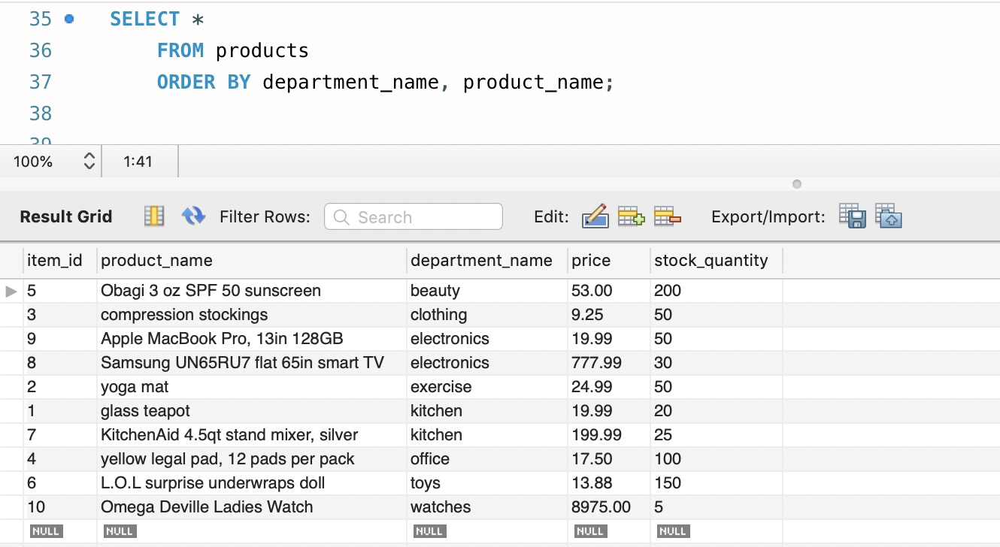
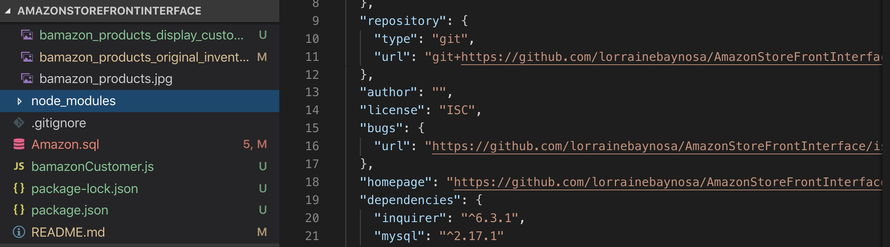
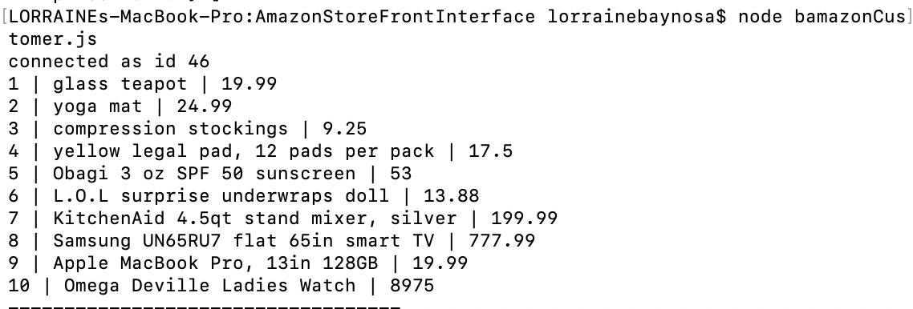

# AmazonStoreFrontInterface
AmazonStoreFrontInterface creates an Amazon-like storefront that takes in orders from customers and depletes stock from the store's inventory. As a bonus task, you can program your app to track product sales across your store's departments and then provide a summary of the highest-grossing departments in the store. SQL statements will be used to create the schema (structure for the database), while npm packages inquire and mysql will be used to prompt customers for answers and query and update the database stored/displayed in MySQLworkbench, respectively. 

AmazonStoreFrontInterface is a Command Line Interface(CLI) application that takes in user input and returns data. Screenshots will be displayed showing typical user flow through the application (customer and/or manager/supervisor),including prompts and responses after various selctions.

CUSTOMER VIEW: 
Definitions for column names: 
   * item_id (unique id for each product)
   * product_name (Name of product)
   * department_name
   * price (cost to customer)
   * stock_quantity (how much of the product is available in stores)

In mySQLWorkbench, the code for creating the products table within the bamazon database (bamazon.products):

In mySQLWorkbench, populating the products table with products:

In mySQLWorkbench, populating the products table with products, actual display:

In order to run bamazonCustomer.js on node.js, will need to 
1. run npm init to create package.json file with inquirer and mysql dependencies from the terminal and 
2. run npm install inquirer and npm install mysql to create node_modules to store the npm packages: 

Running this application will first display all items available for sale. Include ids, names, and prices for sale (customer view of products table).

The app should then prompt users with two messages.
   * The first should ask them the ID of the product they would like to buy.
   * The second message should ask how many units of the product they would like to buy.

Once the customer has placed the order, your application should check if your store has enough of the product to meet the customer's request.
   * If not, the app should log a phrase like `Insufficient quantity!`, and then prevent the order from going through.

However, if your store _does_ have enough of the product, you should fulfill the customer's order.
   * This means updating the SQL database to reflect the remaining quantity.
   * Once the update goes through, show the customer the total cost of their purchase.

In order to test this code, the user will need to:

1. Install mySQLWorkbench and create password for mySQLWorkbench 
2. Execute code in Amazon.sql in mySQLWorkbench
3. initiate and install all the npm packages listed in bamazonCustomer.js: inquirer, mysql
4. Enter password for mySQLWorkbench in bamazonCustomer.js
