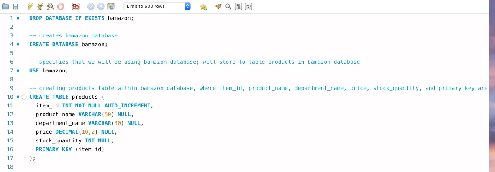
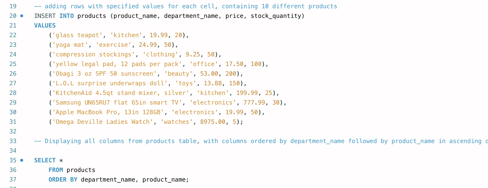

# AmazonStoreFrontInterface
AmazonStoreFrontInterface creates an Amazon-like storefront that takes in orders from customers and depletes stock from the store's inventory. As a bonus task, you can program your app to track product sales across your store's departments and then provide a summary of the highest-grossing departments in the store. SQL statements will be used to create the schema (structure for the database), while npm packages inquire and mysql will be used to prompt customers for answers and query and update the database stored/displayed in MySQLworkbench, respectively. 

AmazonStoreFrontInterface is a Command Line Interface(CLI) application that takes in user input and returns data. Screenshots will be displayed showing typical user flow through the application (customer and/or manager/supervisor),including prompts and responses after various selctions.

Definitions for column names: 
   * item_id (unique id for each product)
   * product_name (Name of product)
   * department_name
   * price (cost to customer)
   * stock_quantity (how much of the product is available in stores)

In mySQLWorkbench, the code for creating the products table within the bamazon database (bamazon.products):

In mySQLWorkbench, populating the products table with products 

